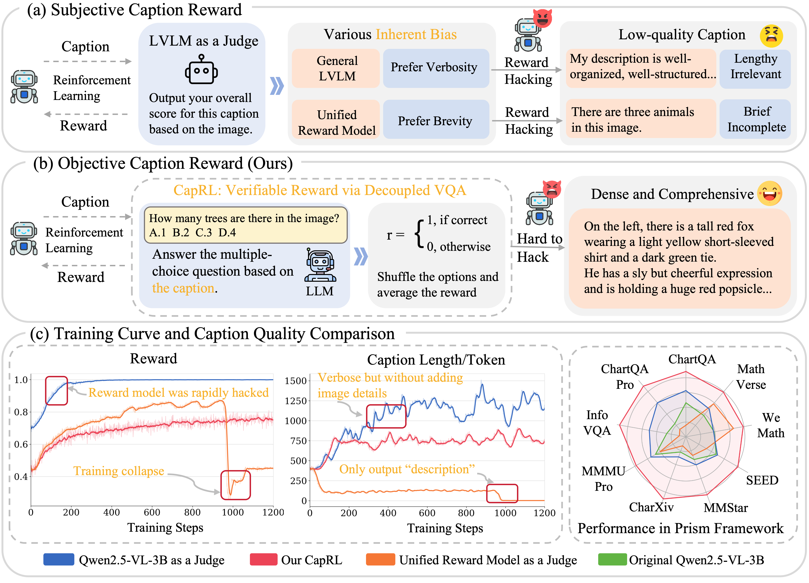
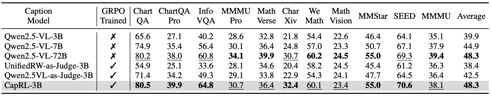
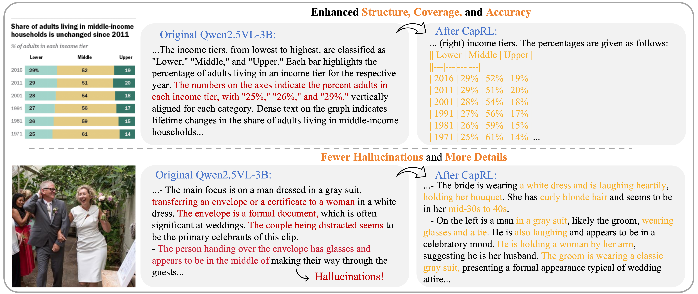
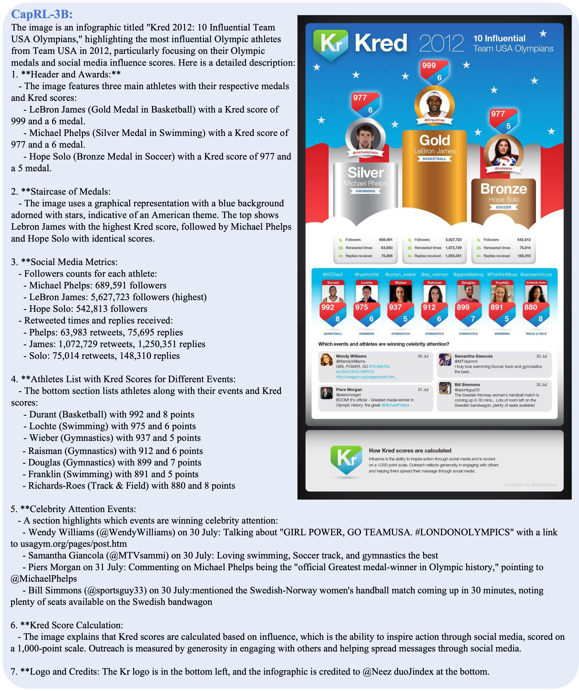
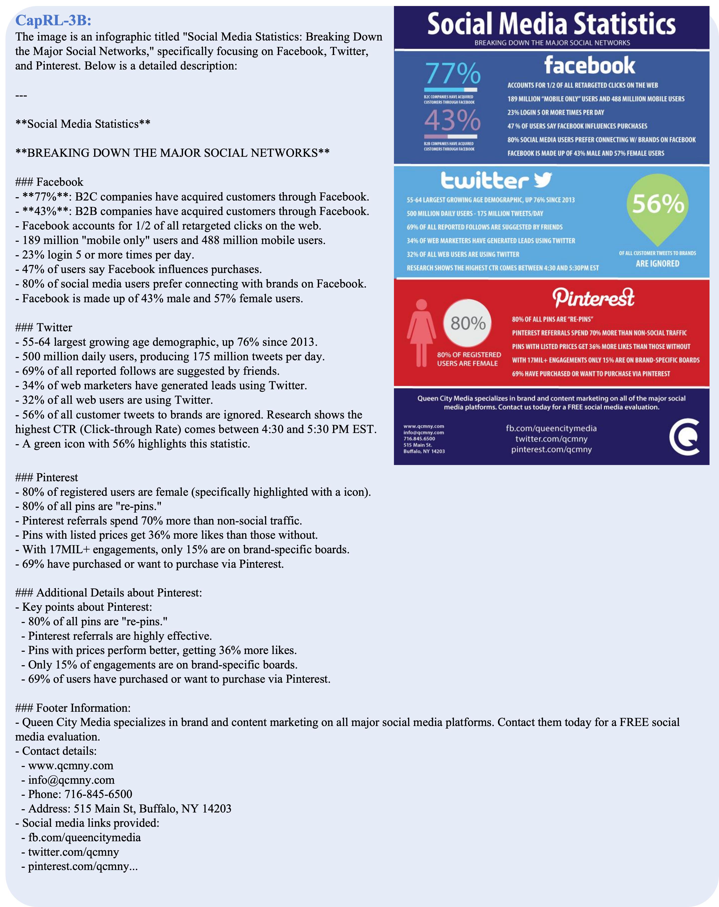

<p align="center">
<!--   <h1 align="center"></h1> -->
  <h1 align="center">CapRL: Stimulating Dense Image Caption Capabilities via Reinforcement Learning</h1>
    <p align="center">
    <a href="https://github.com/Cooperx521"><strong>Long Xing*</strong></a>
    ·
    <a href="https://lightdxy.github.io/"><strong>Xiaoyi Dong*</strong></a>
    ·
    <a href="https://yuhangzang.github.io/"><strong>Yuhang Zang</strong></a>
    ·
    <a href="https://scholar.google.com/citations?user=sJkqsqkAAAAJ"><strong>Yuhang Cao</strong></a>
    ·
    <a href="https://github.com/shikiw"><strong>Jianze Liang</strong></a>
    ·
    <a href="https://github.com/shikiw"><strong>Qidong Huang</strong></a>
    ·
  <a href="https://myownskyw7.github.io/"><strong>Jiaqi Wang</strong></a> ·
  <a href="https://scholar.google.com/citations?user=5bInRDEAAAAJ&hl=zh-CN"><strong>Feng Wu</strong></a> ·
  <a href="http://dahua.site/"><strong>Dahua Lin</strong></a>

  </p>
  📖<a href="">Paper</a> |🤗<a href="https://huggingface.co/internlm/CapRL-3B">CapRL-3B Model</a> |
  🤗<a href="https://huggingface.co/datasets/internlm/CapRL-2M">CapRL-2M Dataset</a> | 🤗<a href="">Daily Paper</a></h3>
<div align="center"></div>
<p align="center">
  <p>
🌈We are excited to introduce <strong>CapRL-3B</strong>, a lightweight 3B image captioner that achieves perception capabilities comparable to Qwen2.5-VL-72B.
By employing CapRL training framework, initializing with the Qwen2.5-VL-3B model, and using a carefully filtered 75K QA dataset as the training set, we obtained a highly capable captioner, CapRL-3B.

  </p>

<a href="">
  
</a>
<a href="">
  
</a>


## 📢 News
- 🚀 [09/25/2025] We release **CapRL** repository, model, evaluation code and dataset.


## 💡 Highlights
- 🔥 **Remarkable visual understanding for Chart, Infographics and Document**: CapRL-3B achieves perception accuracy and visual information coverage comparable to Qwen2.5-VL-72B.
- 🔥 **Well-organized output**: The outputs of CapRL-3B are relatively well-structured, making them clear and easy to understand.
- 🔥 **Detailed description for natural images**: The outputs of CapRL-3B can perfectly cover all valid visual information while containing fewer hallucinations.


## 👨‍💻 Todo

- [ ] Release training code.
- [ ] Release 75k QA dataset.
- [ ] Release CapRL-series on stronger base model.

## 🛠️ Setup
```
git clone https://github.com/InternLM/CapRL.git
conda create -n CapRL python=3.10
conda activate CapRL
bash setup.sh
```

## ⭐️ Quick Start
If you want to use **CapRL-3B** for captioning, you can directly follow the exact same inference approach as in [Qwen2.5-VL-series](https://github.com/QwenLM/Qwen3-VL/tree/d2240f11656bfe404b9ba56db4e51cd09f522ff1).

We recommend using **vLLM** to speed up inference.


### Start an OpenAI API Service

Run the command below to start an OpenAI-compatible API service:

```bash
vllm serve "/PATH/CapRL-3B" \
    --trust-remote-code \
    --tensor-parallel-size=1 \
    --pipeline-parallel-size=1 \
    --gpu_memory_utilization=0.95 \
    --served-model-name=caprl \
    --port 8000 \
    --host 0.0.0.0
```

Then you can use the chat API as below: (see [OpenAI API protocol document](https://platform.openai.com/docs/guides/vision/uploading-base-64-encoded-images) for more details):
```python
import base64
from openai import OpenAI
# Set OpenAI's API key and API base to use vLLM's API server.
openai_api_key = "EMPTY"
openai_api_base = "http://localhost:8000/v1"
client = OpenAI(
    api_key=openai_api_key,
    base_url=openai_api_base,
)
image_path = "/path/to/local/image.png"
with open(image_path, "rb") as f:
    encoded_image = base64.b64encode(f.read())
encoded_image_text = encoded_image.decode("utf-8")
base64_qwen = f"data:image;base64,{encoded_image_text}"
chat_response = client.chat.completions.create(
    model="caprl",
    messages=[
        {"role": "system", "content": "You are a helpful assistant."},
        {
            "role": "user",
            "content": [
                {
                    "type": "image_url",
                    "image_url": {
                        "url": base64_qwen
                    },
                },
                {"type": "text", "text": "What is the text in the illustrate?"},
            ],
        },
    ],
    temperature=1.0,
    max_tokens=max_tokens,
    top_p=1.0,
    extra_body={
        "repetition_penalty": 1.0,
        },
)
print("Chat response:", chat_response)
```

## Pretraining

### Datasets

Our **CapRL-2M** dataset is available on :
[🔗 Hugging Face](https://huggingface.co/datasets/internlm/CapRL-2M)

It includes images from [ShareGPT-1M](https://huggingface.co/datasets/Lin-Chen/ShareGPT4V) and [DenseFusion-1M](https://huggingface.co/datasets/BAAI/DenseFusion-1M), with high-quality captions re-annotated using CapRL-3B, totaling 2M samples.

In our JSONL files, we provide the captions along with their corresponding image paths. The images can be downloaded from ShareGPT-1M and DenseFusion-1M.


### Reproducing Pretraining Experiments

To reproduce the pretraining experiments presented in our paper:

1. **Initialize Qwen2.5-VL.**
   Follow the steps in the notebook [`initiallize_vlm_3b.ipynb`](https://github.com/Cooperx521/ScaleCap/blob/892ad0682defa37f54833c3c4284a9d9a5c3451e/grocery_file/initiallize_vlm_3b.ipynb) to set up the Qwen2.5-VL model for training.

2. **Training.**
   You can then use [LLaMAFactory](https://github.com/hiyouga/LLaMA-Factory) directly to run the training process.


## Comparing Caption Quality via Prism Framework

We evaluate caption quality by **decoupling the traditional VQA (Visual Question Answering) task**:

1. First, a model generates a **caption** for the image.
2. Then, a **language model** answers questions based solely on the generated caption.

This approach allows us to assess the **informational quality and completeness** of the generated captions — if the language model can accurately answer visual questions based only on the caption, then the caption is likely high-quality.

The complete evaluation scripts can be found in the `Prism_Evaluation` folder, with the core implementation located in `Eval_CapRL.py`.


### Cases
<a href="">
  
</a>

<a href="">
  
</a>
<a href="">
  
</a>
<a href="">
  
</a>

## 📄 License
  

**Usage and License Notices**: The data and code are intended and licensed for research use only.
License: Attribution-NonCommercial 4.0 International It should abide by the policy of OpenAI: https://openai.com/policies/terms-of-use

## ❤️ Acknowledgments
- [Open-LLaVA-NeXT](https://github.com/xiaoachen98/Open-LLaVA-NeXT): Thanks for the impressive open-source dataset.
- [VLMEvalKit](https://github.com/open-compass/VLMEvalKit): the amazing open-sourced suit for evaluating various LMMs!