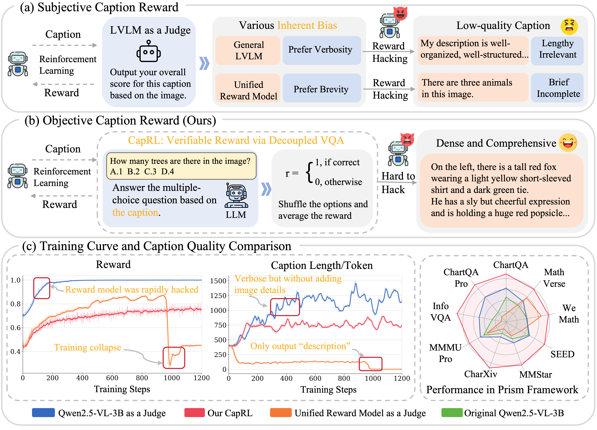
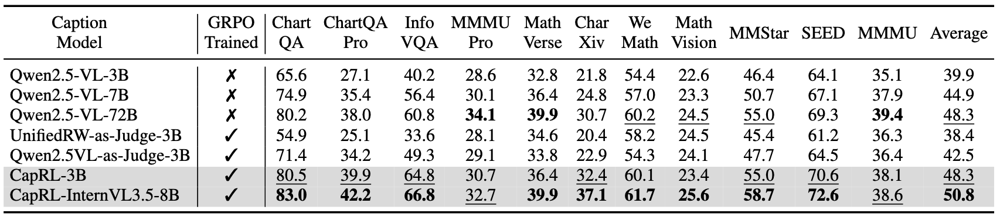
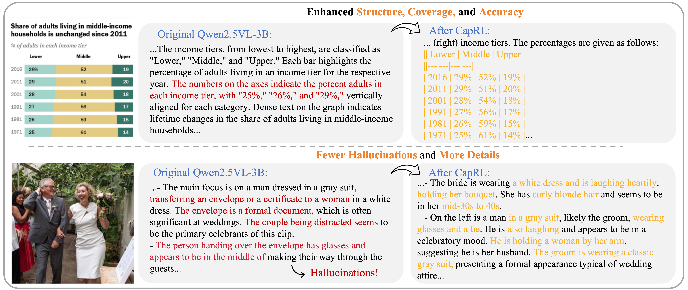
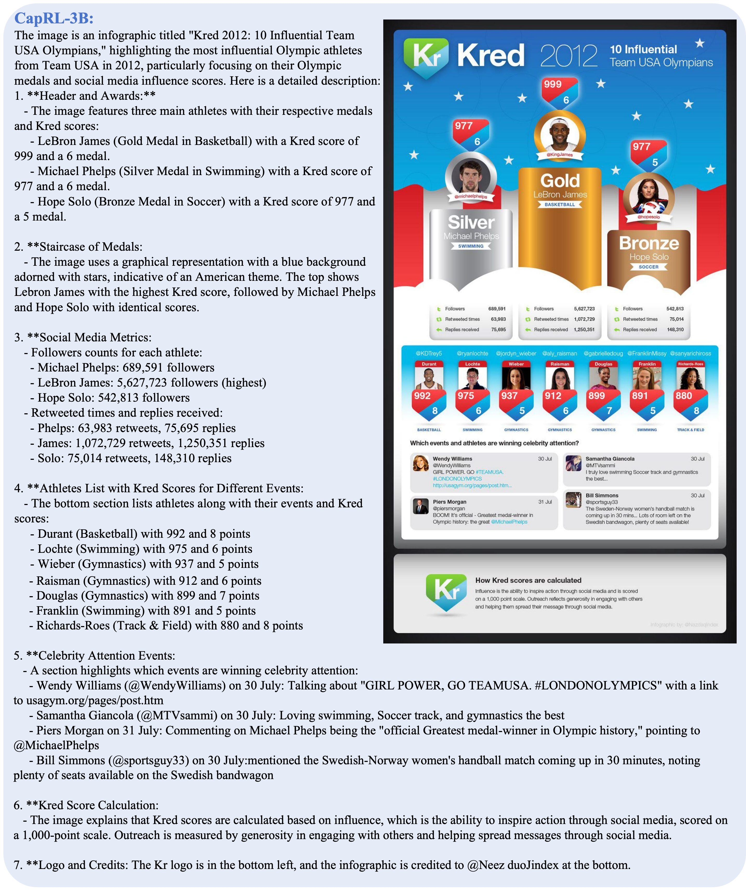
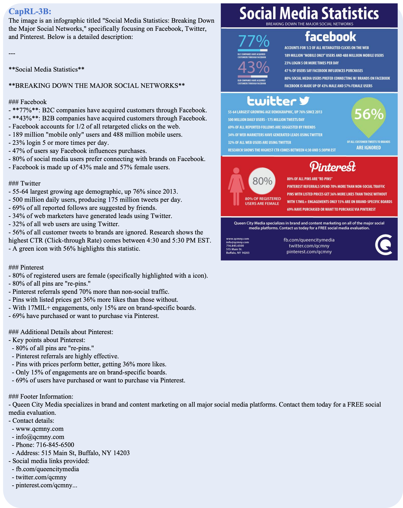

<p align="center">
<!--   <h1 align="center"></h1> -->
  <h1 align="center">CapRL: Stimulating Dense Image Caption Capabilities via Reinforcement Learning</h1>
    <p align="center">
    <a href="https://github.com/Cooperx521"><strong>Long Xing*</strong></a>
    ·
    <a href="https://lightdxy.github.io/"><strong>Xiaoyi Dong*</strong></a>
    ·
    <a href="https://yuhangzang.github.io/"><strong>Yuhang Zang</strong></a>
    ·
    <a href="https://scholar.google.com/citations?user=sJkqsqkAAAAJ"><strong>Yuhang Cao</strong></a>
    ·
    <a href="https://scholar.google.com/citations?user=P4yNnSkAAAAJ&hl=zh-TW"><strong>Jianze Liang</strong></a>
    ·
    <a href="https://github.com/shikiw"><strong>Qidong Huang</strong></a>
    ·
  <a href="https://myownskyw7.github.io/"><strong>Jiaqi Wang</strong></a> ·
  <a href="https://scholar.google.com/citations?user=5bInRDEAAAAJ&hl=zh-CN"><strong>Feng Wu</strong></a> ·
  <a href="http://dahua.site/"><strong>Dahua Lin</strong></a>


📖<a href="https://arxiv.org/abs/2509.22647">Paper</a> | 🏠<a href="https://github.com/InternLM/CapRL">Github</a> | 🤗<a href="https://huggingface.co/collections/long-xing1/caprl-68d64ac32ded31596c36e189">CapRL Collection</a> | 🤗<a href="https://huggingface.co/papers/2509.22647">Daily Paper</a> 

#### CapRL Series Model & Dataset
| Series | Models & Resources |
| :--- | :--- |
| **CapRL 2.0 Series** | [🤗 CapRL-Qwen3VL-2B](https://huggingface.co/internlm/CapRL-Qwen3VL-2B) \| [🤗 CapRL-Qwen3VL-4B](https://huggingface.co/internlm/CapRL-Qwen3VL-4B) |
| **CapRL 1.0 Series** | [🤗 CapRL-Qwen2.5VL-3B](https://huggingface.co/internlm/CapRL-3B) \| [🤗 CapRL-InternVL3.5-8B](https://huggingface.co/yuhangzang/CapRL-InternVL3.5-8B) \| [📊 CapRL-2M Dataset](https://huggingface.co/datasets/internlm/CapRL-2M) \| [📦 CapRL-3B-GGUF](https://huggingface.co/mradermacher/CapRL-3B-GGUF) \| [📦 CapRL-3B-i1-GGUF](https://huggingface.co/mradermacher/CapRL-3B-i1-GGUF) |

We are excited to release the **CapRL 2.0 series**: **CapRL-Qwen3VL-2B** and **CapRL-Qwen3VL-4B**. These models feature fewer parameters while delivering even more powerful captioning performance. 
Notably, **CapRL-Qwen3VL-2B outperforms both CapRL-Qwen2.5VL-3B and Qwen2.5VL-72B in captioning tasks, while CapRL-Qwen3VL-4B further demonstrates a significant performance leap over the 2B version.**
This improvement in efficiency is driven by our upgraded training recipe, which includes a more rigorous QA data filter and a significantly more diverse image dataset. We welcome everyone to try them out!


When selecting between the available CapRL models, it's essential to consider the trade-off between performance and computational cost.
This guide will help you choose the most suitable model for your specific needs:
|Model|Parameters|Strength|
|-|-|-|
|🤗[CapRL-Qwen3VL-2B](https://huggingface.co/internlm/CapRL-Qwen3VL-2B)|2B|Speed, Efficiency|
|🤗[CapRL-Qwen3VL-4B](https://huggingface.co/internlm/CapRL-Qwen3VL-4B)|4B|High Performance, Advanced Captioning Ability|

Now you can try out CapRL-3B with your own images🎨!&nbsp;&nbsp;&nbsp;&nbsp;➡️&nbsp;&nbsp;&nbsp;&nbsp;[🌈CapRL Space](https://huggingface.co/spaces/yuhangzang/caprl)


## 📢 News
We are working on even stronger base models and upgrading our training recipe — stay tuned!
- 🔥 [12/24/2025] We are excited to release the CapRL 2.0 series: **[CapRL-Qwen3VL-2B](https://huggingface.co/internlm/CapRL-Qwen3VL-2B)** and **[CapRL-Qwen3VL-4B](https://huggingface.co/internlm/CapRL-Qwen3VL-4B)**!
- 🔥 [12/24/2025] The total downloads of the CapRL-related [models and dataset](https://huggingface.co/collections/long-xing1/caprl-68d64ac32ded31596c36e189) reached 17,000!
- 🔥 [10/15/2025] The total downloads of the CapRL-related [models and dataset](https://huggingface.co/collections/long-xing1/caprl-68d64ac32ded31596c36e189) reached 6,000 within just 20 days!
- 🚀 [10/15/2025] We are excited to announce the release of **[CapRL-InternVL3.5-8B](https://huggingface.co/internlm/CapRL-InternVL3.5-8B)**, whose image captioning capability outperforms Qwen2.5-VL-72B!
- 🚀 [10/15/2025] Thanks [mradermacher](https://huggingface.co/mradermacher) for the valuable contribution! [CapRL-3B-GGUF](https://huggingface.co/mradermacher/CapRL-3B-GGUF) is the static quants version, and [CapRL-3B-i1-GGUF](https://huggingface.co/mradermacher/CapRL-3B-i1-GGUF) is weighted/imatrix quants version.
- 🚀 [10/15/2025] We release [QA curation code](https://github.com/InternLM/CapRL).
- 🚀 [09/25/2025] We release **CapRL** repository, [CapRL-3B model](https://huggingface.co/internlm/CapRL-3B), [evaluation code](https://github.com/InternLM/CapRL) and [dataset](https://huggingface.co/datasets/internlm/CapRL-2M).


## Introduction
🌈We are excited to introduce <strong>CapRL-3B</strong>, a lightweight 3B image captioner that achieves perception capabilities comparable to Qwen2.5-VL-72B.
By employing CapRL training framework, initializing with the Qwen2.5-VL-3B model, and using a carefully filtered 75K QA dataset as the training set, we obtained a highly capable captioner, CapRL-3B.


  </p>

<a href="">
  
</a>
<a href="">
  
</a>


## 💡 Highlights
- 🔥 **Remarkable visual understanding for Chart, Infographics and Document**: CapRL-3B achieves perception accuracy and visual information coverage comparable to Qwen2.5-VL-72B.
- 🔥 **Well-organized output**: The outputs of CapRL-3B are relatively well-structured, making them clear and easy to understand.
- 🔥 **Detailed description for natural images**: The outputs of CapRL-3B can perfectly cover all valid visual information while containing fewer hallucinations.

## Model Card
- Based on the same recipe as CapRL-3B, we used InternVL3.5-8B as the policy model and obtained CapRL-InternVL3.5-8B through CapRL.
- CapRL-3B-GGUF is static quants version, and CapRL-3B-i1-GGUF is weighted/imatrix quants version. Thanks for their contribution!


## 👨‍💻 Todo

- [ ] Release training code.
- [ ] Release 75k QA dataset.
- [ ] Release CapRL-series on stronger base model.

## 🛠️ Setup
```
git clone https://github.com/InternLM/CapRL.git
conda create -n CapRL python=3.10
conda activate CapRL
bash setup.sh
```

## ⭐️ Quick Start
If you want to use **CapRL-3B** for captioning, you can directly follow the exact same inference approach as in [Qwen2.5-VL-series](https://github.com/QwenLM/Qwen3-VL/tree/d2240f11656bfe404b9ba56db4e51cd09f522ff1).

The prompt we use for training and evaluation is `Please describe this image in detail.`

We recommend using **vLLM** to speed up inference.


### Start an OpenAI API Service

Run the command below to start an OpenAI-compatible API service:

```bash
vllm serve "/PATH/CapRL-3B" \
    --trust-remote-code \
    --tensor-parallel-size=1 \
    --pipeline-parallel-size=1 \
    --gpu_memory_utilization=0.95 \
    --served-model-name=caprl \
    --port 8000 \
    --host 0.0.0.0
```

Then you can use the chat API as below: (see [OpenAI API protocol document](https://platform.openai.com/docs/guides/vision/uploading-base-64-encoded-images) for more details):
```python
import base64
from openai import OpenAI
# Set OpenAI's API key and API base to use vLLM's API server.
openai_api_key = "EMPTY"
openai_api_base = "http://localhost:8000/v1"
client = OpenAI(
    api_key=openai_api_key,
    base_url=openai_api_base,
)
image_path = "/path/to/local/image.png"
with open(image_path, "rb") as f:
    encoded_image = base64.b64encode(f.read())
encoded_image_text = encoded_image.decode("utf-8")
base64_qwen = f"data:image;base64,{encoded_image_text}"
chat_response = client.chat.completions.create(
    model="caprl",
    messages=[
        {
            "role": "user",
            "content": [
                {
                    "type": "image_url",
                    "image_url": {
                        "url": base64_qwen
                    },
                },
                {"type": "text", "text": "Please describe this image in detail."},
            ],
        },
    ],
    temperature=1.0,
    max_tokens=max_tokens,
    top_p=1.0,
    extra_body={
        "repetition_penalty": 1.0,
        },
)
print("Chat response:", chat_response)
```
## QA Curation

This part of the code is in the `QA_data_curation` folder, which contains all four steps for generating QA data:

1. **QA generation.** Use Qwen2.5-VL-72B to generate 5 QAs for each image. The generation process launches a vLLM service and uses multi-threading to speed up.
2. **QA extraction.** Extract QAs through format matching.
3. **Qwen2.5-VL-3B answer question.** Use Qwen2.5-VL-3B to answer questions with and without images. The parameter `ROTATE_NUM` controls how many times each question is answered. If a question is answered only once, the randomness may be too high and can easily lead to misjudgment.
4. **Filter question.** We keep QA pairs with `visual acc` higher than 0.75 and `text acc` lower than 0.25 to avoid data leakage and ensure the model can correctly answer questions when images are provided.


## Pretraining

### Datasets

Our **CapRL-2M** dataset is available on :
[🔗 Hugging Face](https://huggingface.co/datasets/internlm/CapRL-2M)

It includes images from [ShareGPT-1M](https://huggingface.co/datasets/Lin-Chen/ShareGPT4V) and [DenseFusion-1M](https://huggingface.co/datasets/BAAI/DenseFusion-1M), with high-quality captions re-annotated using CapRL-3B, totaling 2M samples.

In our JSONL files, we provide the captions along with their corresponding image paths. The images can be downloaded from ShareGPT-1M and DenseFusion-1M.


### Reproducing Pretraining Experiments

To reproduce the pretraining experiments presented in our paper:

1. **Initialize Qwen2.5-VL.**
   Follow the steps in the notebook [`initiallize_vlm_3b.ipynb`](https://github.com/Cooperx521/ScaleCap/blob/892ad0682defa37f54833c3c4284a9d9a5c3451e/grocery_file/initiallize_vlm_3b.ipynb) to set up the Qwen2.5-VL model for training.

2. **Training.**
   You can then use [LLaMAFactory](https://github.com/hiyouga/LLaMA-Factory) directly to run the training process.


## Comparing Caption Quality via Prism Framework

We evaluate caption quality by **decoupling the traditional VQA (Visual Question Answering) task**:

1. First, a model generates a **caption** for the image.
2. Then, a **language model** answers questions based solely on the generated caption.

This approach allows us to assess the **informational quality and completeness** of the generated captions — if the language model can accurately answer visual questions based only on the caption, then the caption is likely high-quality.

The complete evaluation scripts can be found in the `Prism_Evaluation` folder, with the core implementation located in `Eval_CapRL.py`.


The model used for answering questions based on captions is [CapRL-Eval-3B](https://huggingface.co/internlm/CapRL-Eval-3B), which is a finetuned version of Qwen2.5-VL-3B. When dealing with tasks such as ChartQA (not multiple-choice questions), it provides more stable output formatting.

You can specify `--reward-model-path` as the path to **CapRL-Eval-3B** in `Eval_CapRL.py`.


### Cases
<a href="">
  
</a>

<a href="">
  
</a>
<a href="">
  
</a>
<a href="">
  
</a>

## 📄 License
  

**Usage and License Notices**: The data and code are intended and licensed for research use only.
License: Attribution-NonCommercial 4.0 International It should abide by the policy of OpenAI: https://openai.com/policies/terms-of-use

## ❤️ Acknowledgments
- [Open-LLaVA-NeXT](https://github.com/xiaoachen98/Open-LLaVA-NeXT): Thanks for the impressive open-source dataset.
- [VLMEvalKit](https://github.com/open-compass/VLMEvalKit): the amazing open-sourced suit for evaluating various LMMs!
